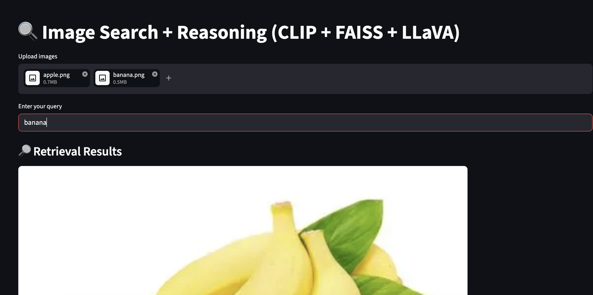
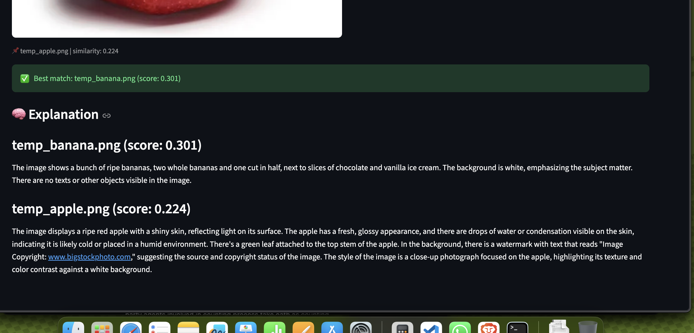

# 🔍 Image Search + Reasoning (CLIP + FAISS + LLaVA)

A multimodal image retrieval and reasoning system that combines:

- CLIP for image-text embeddings
- FAISS for fast vector similarity search
- LLaVA for visual understanding and explanation

---

## 🚀 Features

- Upload multiple images
- Search using natural language queries
- Retrieve similar images using embeddings
- Explain results using a vision-language model
- Confidence-aware retrieval

---

## 🧠 Architecture

User Query  
↓  
CLIP → Embedding  
↓  
FAISS → Retrieve Top-K Images  
↓  
LLaVA → Explain Results  

---

## 📸 Demo




---

## ⚙️ Installation

```bash
git clone https://github.com/johnkallimelvarghese/Multimodal-Image-Search-using-CLIP-FAISS-LLaVA
cd image-search-reasoning
pip install -r requirements.txt
streamlit run app.py
```
## 🛠️ Dev Setup (Optional)

If you plan to modify or extend the project, install additional development dependencies:

```bash
pip install -r requirements-dev.txt
```


